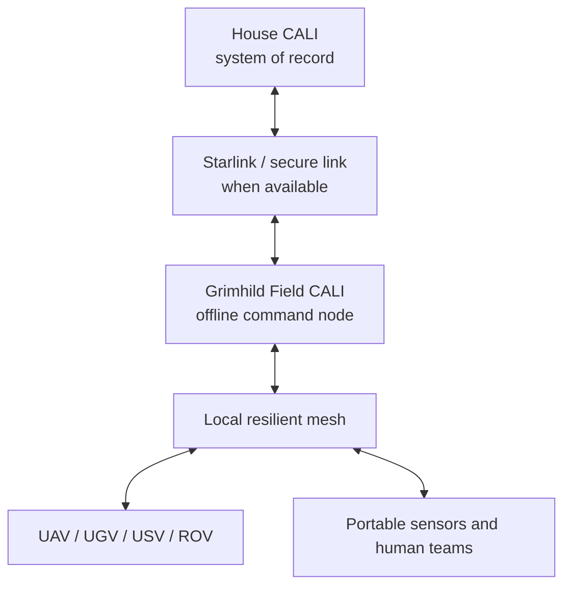

# ÆSIR Integrated Response

**Machines enter danger first. People enter with a plan.**

ÆSIR Integrated Response is an open, modular framework for coordinating unmanned aircraft, ground vehicles, surface vessels, underwater vehicles, fixed sensors, and human teams during search, rescue, disaster response, inspection, and recovery missions.

The project is the integration layer for the broader Æsir Autonomous Systems ecosystem. Individual vehicles remain independently useful; this repository defines how they exchange information, coordinate coverage, preserve evidence, and turn multiple sensor feeds into a shared operational picture.

## Mission

A complex search should not depend on one vehicle, one sensor, or a continuous cloud connection. ÆSIR combines complementary systems so responders can:

- survey large areas before placing people in danger;
- build georeferenced maps from aerial, surface, ground, and underwater observations;
- identify gaps, anomalies, and probable targets in near real time;
- retask autonomous assets as new evidence appears;
- retain useful capability when internet and cellular service are unavailable;
- hand human teams a documented plan instead of a pile of disconnected video feeds.

## System of systems

| Element | Primary role | Typical data |
| --- | --- | --- |
| UAV | Rapid overview, mapping, overwatch, relay | RGB, thermal, LiDAR, photogrammetry |
| UGV | Rubble and confined-area access | Video, thermal, audio, gas, local 3D map |
| USV | Surface search and deployment platform | Sonar, bathymetry, navigation, weather |
| ROV | Underwater inspection and recovery support | Video, sonar, depth, target position |
| Fixed/portable sensors | Persistent local awareness | RF, acoustic, weather, environmental |
| Grimhild field node | Mobile command, storage, mission control | Common operating picture and local services |
| CALI/NOMAD | Offline-first analysis and operator assistance | Sensor fusion, prioritization, mission records |
| House CALI | Long-term system of record and remote support | Archives, models, planning, fleet knowledge |

## Core architecture

Grimhild must remain operational without House CALI or the public internet. Starlink and other backhaul links extend capability; they are not mission-critical dependencies.

## Initial use cases

- Hurricane damage assessment and survivor search
- Flood and waterway search
- Building-collapse reconnaissance
- Missing-person search over large or difficult terrain
- Underwater inspection and recovery preparation
- Infrastructure inspection
- Hazardous-site mapping
- Evidence-led search planning before deploying divers or entry teams

## Design principles

1. **Offline first.** Local maps, models, mission control, and data storage remain usable without external services.
2. **Interoperable.** MAVLink, ROS 2, standard geospatial formats, and documented interfaces are preferred.
3. **Human directed.** Automation recommends, prioritizes, and executes bounded tasks while accountable operators retain mission authority.
4. **Evidence aware.** Every observation should retain time, position, source, confidence, and chain-of-custody metadata when applicable.
5. **Graceful degradation.** Loss of one link, sensor, or vehicle should reduce capability rather than collapse the mission.
6. **Serviceable and affordable.** Commodity hardware, open software, and field-replaceable modules are favored.
7. **People first.** Machines enter unstable, contaminated, submerged, or otherwise hazardous spaces before responders do.

## Repository scope

This repository will hold the shared architecture, interface specifications, mission workflows, simulation scenarios, data schemas, and integration software. Vehicle-specific hardware and firmware may live in separate repositories and connect through documented adapters.

- [System architecture](docs/ARCHITECTURE.md)
- [Development roadmap](docs/ROADMAP.md)

## Project status

**Concept and architecture phase.** The immediate goal is to define a minimum viable integrated demonstration using one airborne asset, one surface or ground asset, Grimhild, and an offline CALI/NOMAD node.

## The unofficial shorthand

Around the lab, the communications and coordination layer may occasionally answer to **“Thunderbird 3.”** That is a useful cultural reference and an excellent excuse for dramatic launch language—not the product pitch, architecture standard, or affiliation.

## License

Licensing will be selected before the first software or hardware release. Until then, the contents are shared for project development and should not be treated as an open-source license grant.
