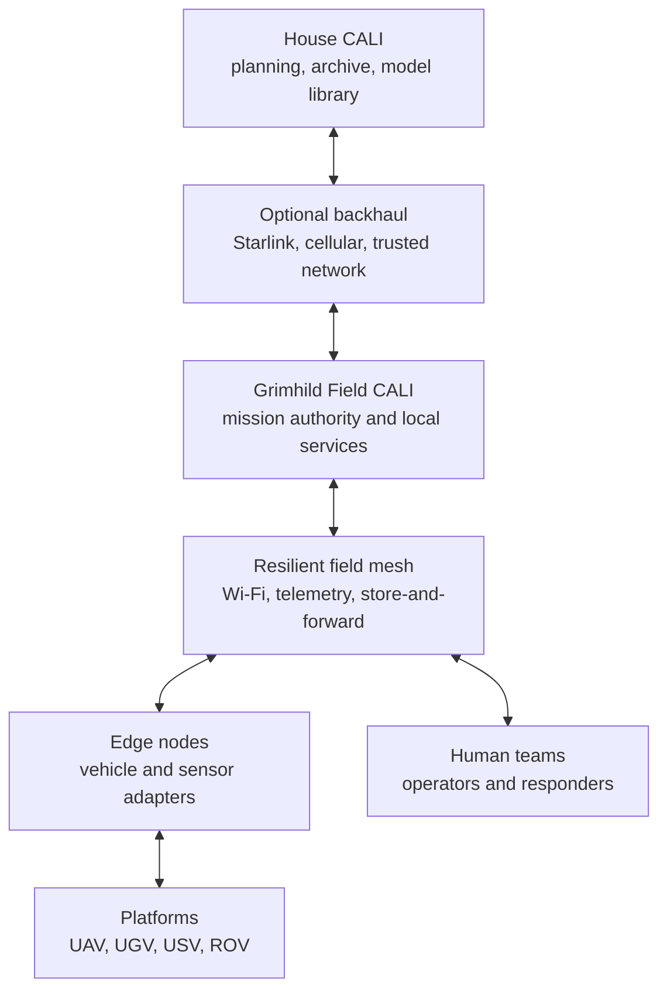
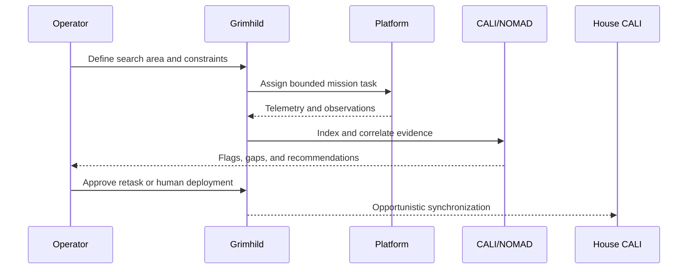

# System Architecture

## Purpose

ÆSIR Integrated Response provides a common mission layer across independently useful unmanned and human-operated assets. The architecture separates vehicle control from mission coordination so that aircraft, ground vehicles, boats, ROVs, sensors, and responder teams can evolve without rebuilding the entire system.

## Operational hierarchy

### House CALI

House CALI is the long-term system of record and remote-support environment. It stores project knowledge, maps, completed mission data, software packages, models, and fleet history. It may assist a field mission through a secure link but must not be required for safe field operation.

### Grimhild Field CALI

Grimhild is the offline-capable mobile command node. It hosts the local common operating picture, mission database, map services, AI assistance, fleet status, and operator interfaces. It is the center of authority during disconnected operations.

### CALI/NOMAD

CALI provides the operator-facing cooperative intelligence layer. NOMAD is the offline-first deployment architecture that supplies local inference, retrieval, maps, mission knowledge, and synchronization. Its initial jobs are to:

- correlate observations by time and position;
- flag anomalies and coverage gaps;
- summarize incoming sensor information;
- recommend follow-up tasks;
- help operators retrieve procedures and prior observations;
- preserve a traceable distinction between measured data, model inference, and human judgment.

### Field mesh

The field mesh transports command, telemetry, alerts, and selected sensor products. High-bandwidth raw data may remain on the originating node and synchronize opportunistically. The system should prioritize traffic by operational value rather than assuming every link can carry every stream.

Suggested priority order:

1. Emergency stop, lost-link, and safety messages
2. Command and control
3. Position, health, and mission telemetry
4. Detection events and low-bandwidth previews
5. Map products and selected imagery
6. Bulk raw sensor data

## Platform roles

### UAV

Rapid area coverage, overwatch, photogrammetry, thermal search, LiDAR collection, and temporary communications relay.

### UGV

Close inspection of rubble, structures, hazardous areas, and confined approaches. Payloads may include cameras, thermal imaging, microphones, gas sensors, and local 3D mapping.

### USV

Waterway search, sonar survey, bathymetric mapping, communications relay, and deployment/recovery of underwater equipment.

### ROV

Close underwater inspection, target confirmation, measurement, and recovery preparation while keeping divers out of the water until evidence justifies deployment.

## Common observation model

Every useful observation should be capable of carrying:

| Field | Purpose |
| --- | --- |
| Observation ID | Globally unique reference |
| Mission ID | Associates data with an operation |
| Source platform/sensor | Establishes origin |
| UTC timestamp | Enables cross-sensor correlation |
| Position and uncertainty | Supports mapping and search decisions |
| Sensor pose | Describes viewing or measurement geometry |
| Data reference | Points to raw or derived evidence |
| Classification | Human or model description |
| Confidence | Quantifies uncertainty without disguising it |
| Provenance | Records processing history |
| Review state | Unreviewed, machine-flagged, human-confirmed, rejected |

A formal schema will follow after representative MAVLink, ROS 2, geospatial, sonar, and media metadata have been evaluated.

## Mission data flow

## Safety and authority boundaries

- Each platform retains a local safe-state behavior for communications loss.
- Mission-level automation operates within operator-approved geographic, time, and action limits.
- AI output is advisory unless an explicitly bounded automation rule has been approved.
- Human teams receive confirmed hazards, uncertainty, and data provenance—not unexplained model conclusions.
- Remote connectivity cannot silently override field authority.
- Design requirement zero: no murdering humanity.

## Near-term integration target

The first integrated demonstration should prove the smallest complete loop:

1. Define a geofenced search area on Grimhild.
2. Dispatch one UAV to produce an orthomosaic or live georeferenced survey.
3. Detect or manually flag an item of interest.
4. Assign a second asset—initially a USV or UGV—to inspect it.
5. Fuse both observations into one mission record.
6. Continue operating after simulated internet loss.
7. Synchronize the completed mission to House CALI when the link returns.
